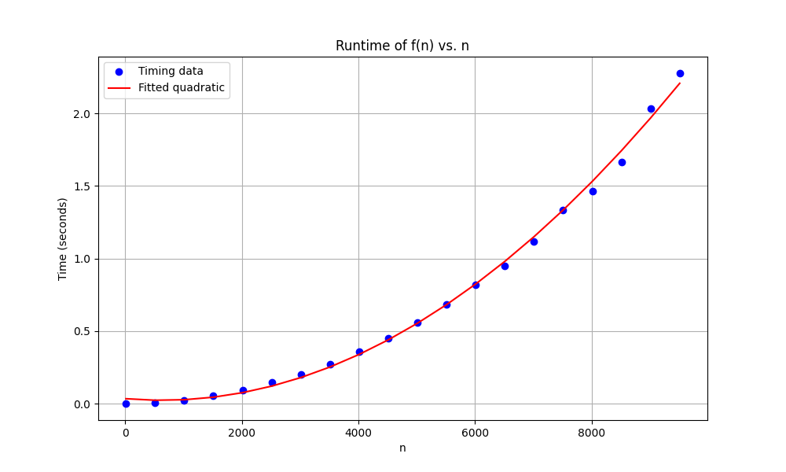
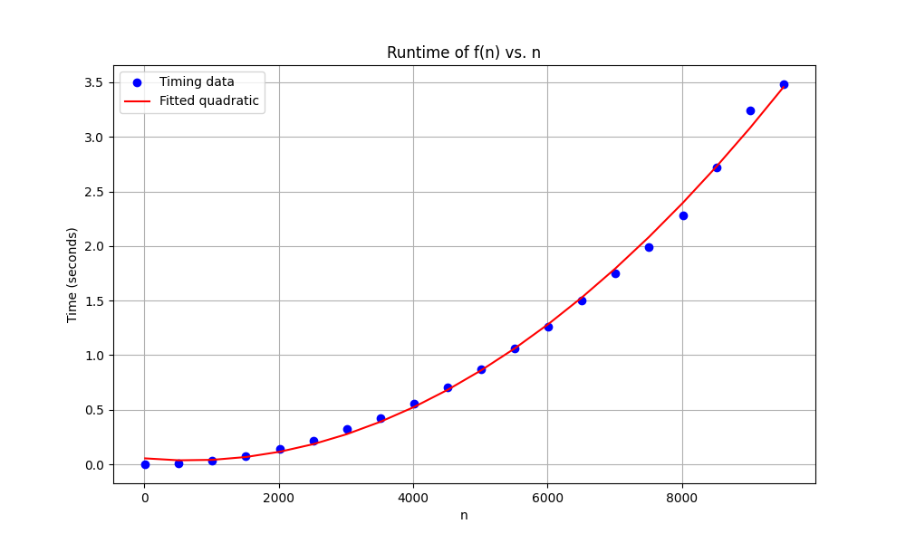

# Hands-on 3

```python
function x = fn(n) 
    x = 1;
    for i = 1:n
        for j = 1:n
            x = x + 1;
```
1. Time complexity of given function
    * `x = 1;` $T(n) = 1$
    * `for i = 1:n` $T(n) = n$
    * `for i = 1:n` $T(n) = \sum_{i=1}^{n-1} \sum_{j=1}^{n} 1$
    * `x = x + 1;` $T(n) = \sum_{i=1}^{n-1} \sum_{j=1}^{n-1} 1$
$T(n) = 1 + n^2$ and time complexity is $\theta(n^2)$

2. Plot


3. Get time complexity for $\Omega$, $\theta$, and $O$
    * Lower Bound: For $n ≥ 1$, $T(n) ≥ n^2$, Therefore the lower bound is $\Omega(n^2)$
    * Upper Bound: $T(n) 1 + n^2 ≤ 2n^2, n ≥ 1$ Thus upper bound is $O(n^2)$
    * Given upper and lowerbound, we can get $\theta(n^2)$

4. I believe the $n_0 ≥ 525$ which is the second dot on the graph 

```python
x = f(n)
   x = 1;
   y = 1;
   for i = 1:n
        for j = 1:n
            x = x + 1;
            y = i + j;
```
4. Yes, it took around 3.5 sec for this updated code to run instead of 2.4 sec in the original version



5. No, the algorithm is still $\theta(n^2)$

