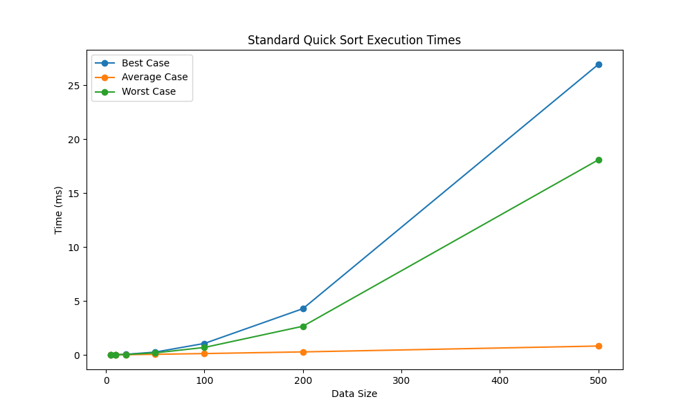

# HW6

## System Info
```
Python Version: 3.12.9
OS: Linux(Docker)
How to run docker: docker compose up --build
```
---
## Sample output
```
hw6-1  | Python 3.12.9
hw6-1  | ------------------------------------------------------------
hw6-1  | Data size: 5
hw6-1  | Best Case:
hw6-1  |   Standard Quick Sort    : 0.012 ms
hw6-1  |   Randomized Quick Sort  : 0.050 ms
hw6-1  | Average Case:
hw6-1  |   Standard Quick Sort    : 0.002 ms
hw6-1  |   Randomized Quick Sort  : 0.033 ms
hw6-1  | Worst Case:
hw6-1  |   Standard Quick Sort    : 0.003 ms
hw6-1  |   Randomized Quick Sort  : 0.032 ms
hw6-1  |
hw6-1  | ------------------------------------------------------------
hw6-1  | Data size: 10
hw6-1  | Best Case:
hw6-1  |   Standard Quick Sort    : 0.014 ms
hw6-1  |   Randomized Quick Sort  : 0.055 ms
hw6-1  | Average Case:
hw6-1  |   Standard Quick Sort    : 0.007 ms
hw6-1  |   Randomized Quick Sort  : 0.114 ms
hw6-1  | Worst Case:
hw6-1  |   Standard Quick Sort    : 0.011 ms
hw6-1  |   Randomized Quick Sort  : 0.054 ms
hw6-1  |
hw6-1  | ------------------------------------------------------------
hw6-1  | Data size: 20
hw6-1  | Best Case:
hw6-1  |   Standard Quick Sort    : 0.045 ms
hw6-1  |   Randomized Quick Sort  : 0.139 ms
hw6-1  | Average Case:
hw6-1  |   Standard Quick Sort    : 0.016 ms
hw6-1  |   Randomized Quick Sort  : 0.141 ms
hw6-1  | Worst Case:
hw6-1  |   Standard Quick Sort    : 0.031 ms
hw6-1  |   Randomized Quick Sort  : 0.150 ms
hw6-1  |
hw6-1  | ------------------------------------------------------------
hw6-1  | Data size: 50
hw6-1  | Best Case:
hw6-1  |   Standard Quick Sort    : 0.254 ms
hw6-1  |   Randomized Quick Sort  : 0.363 ms
hw6-1  | Average Case:
hw6-1  |   Standard Quick Sort    : 0.050 ms
hw6-1  |   Randomized Quick Sort  : 0.382 ms
hw6-1  | Worst Case:
hw6-1  |   Standard Quick Sort    : 0.183 ms
hw6-1  |   Randomized Quick Sort  : 0.351 ms
hw6-1  |
hw6-1  | ------------------------------------------------------------
hw6-1  | Data size: 100
hw6-1  | Best Case:
hw6-1  |   Standard Quick Sort    : 1.059 ms
hw6-1  |   Randomized Quick Sort  : 0.738 ms
hw6-1  | Average Case:
hw6-1  |   Standard Quick Sort    : 0.120 ms
hw6-1  |   Randomized Quick Sort  : 0.770 ms
hw6-1  | Worst Case:
hw6-1  |   Standard Quick Sort    : 0.687 ms
hw6-1  |   Randomized Quick Sort  : 0.799 ms
hw6-1  |
hw6-1  | ------------------------------------------------------------
hw6-1  | Data size: 200
hw6-1  | Best Case:
hw6-1  |   Standard Quick Sort    : 4.284 ms
hw6-1  |   Randomized Quick Sort  : 1.521 ms
hw6-1  | Average Case:
hw6-1  |   Standard Quick Sort    : 0.274 ms
hw6-1  |   Randomized Quick Sort  : 1.641 ms
hw6-1  | Worst Case:
hw6-1  |   Standard Quick Sort    : 2.653 ms
hw6-1  |   Randomized Quick Sort  : 1.619 ms
hw6-1  |
hw6-1  | ------------------------------------------------------------
hw6-1  | Data size: 500
hw6-1  | Best Case:
hw6-1  |   Standard Quick Sort    : 26.942 ms
hw6-1  |   Randomized Quick Sort  : 4.575 ms
hw6-1  | Average Case:
hw6-1  |   Standard Quick Sort    : 0.817 ms
hw6-1  |   Randomized Quick Sort  : 4.387 ms
hw6-1  | Worst Case:
hw6-1  |   Standard Quick Sort    : 18.087 ms
hw6-1  |   Randomized Quick Sort  : 4.244 ms
```
---
## Output Graph

